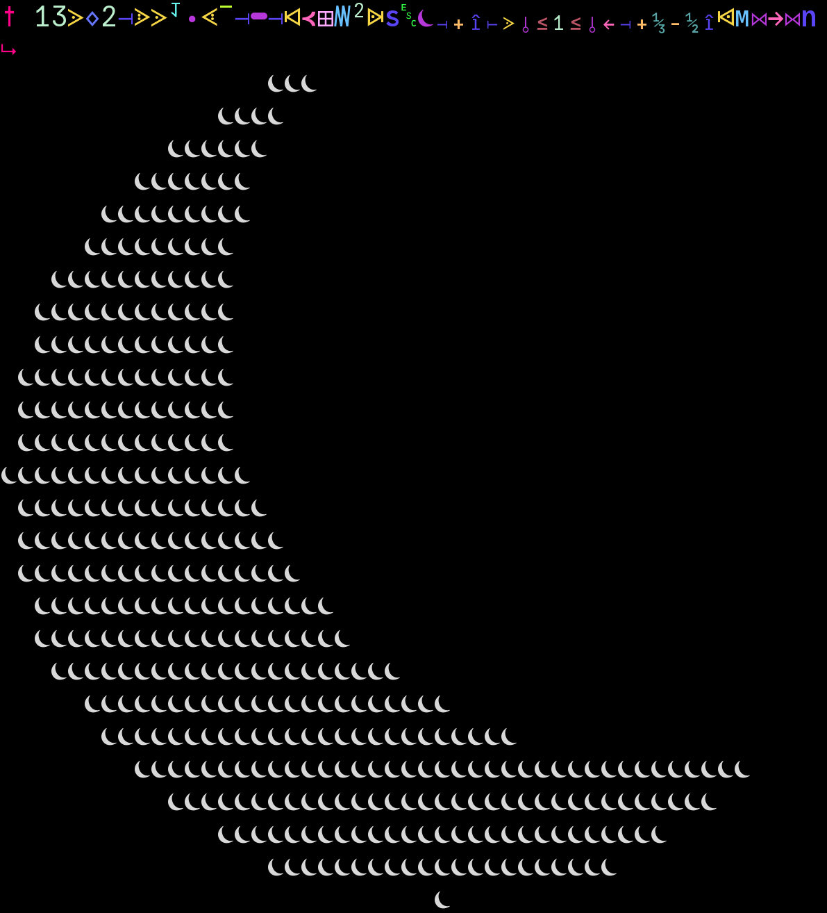

# ☾  

[Online Version](https://ganer.xyz/moon/)

## Local install  
Requires python3.12 or above  
To view code you need the custom font  
> Fonts are in /Extra/FontCompose/Output

To type code the .XCompose is in the same directory  
> You can use WinCompose on Windows

To install (linux/wsl): `git clone --depth 1 https://github.com/ganercodes/moon ; cd moon ; ./install`  
  
Run a file: `☾ /path/to/file.☾`  

### Collaborators
[Used1Brain](https://github.com/Used1Brain/): Mathematical libraries and initial glyph generator
### Credits
[JuliaMono](https://juliamono.netlify.app/) (Base font)  
[NerdFonts](https://www.nerdfonts.com/) (Extra symbols)  
[FontForge](https://fontforge.org/en-US/) (Precedual glyph generation)  
  
Optional dependencies are included in `Extra/Dependencies.txt`
